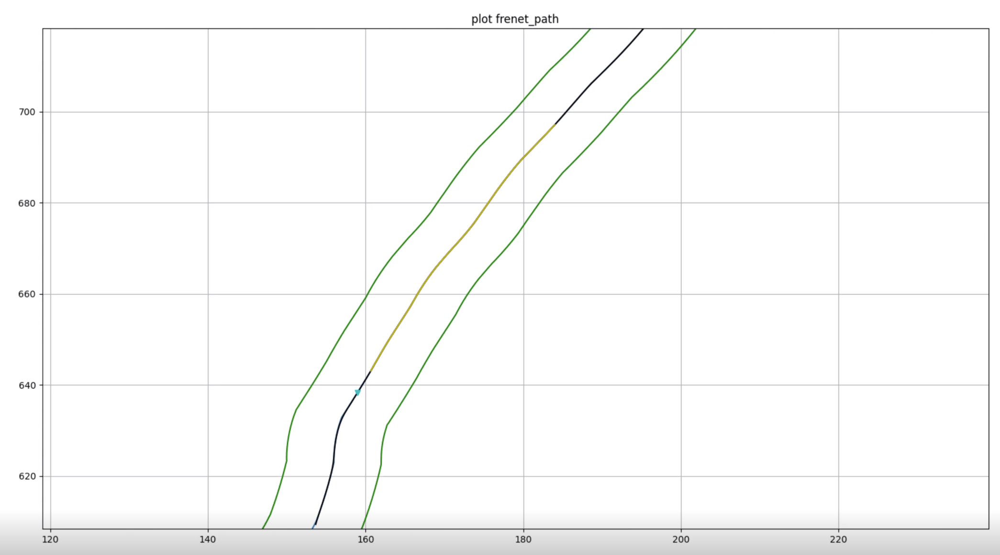
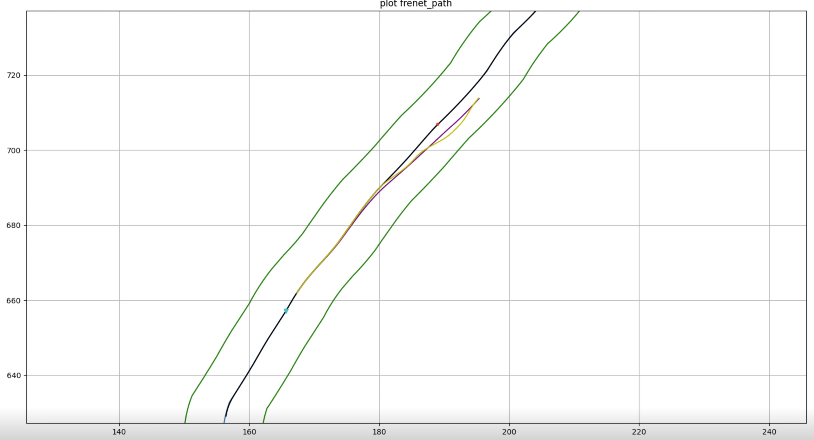
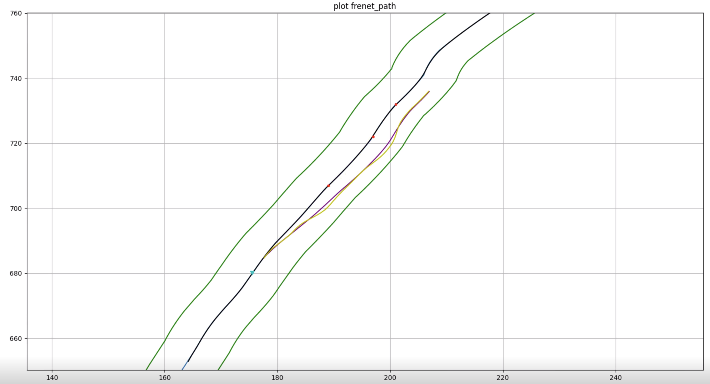
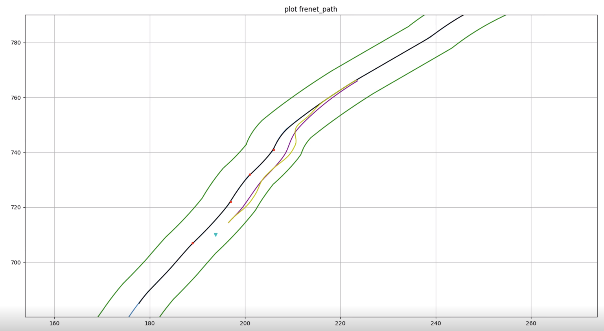

# EM Planner
## Introduction
EM planner is the path planning algorithm of Baidu Apollo automatic driving system. It decomposes the non-convex trajectory planning problem into two sub-problems of path planning and speed planning through dimensionality reduction. This project demonstrates the basic functions of EM planner through simple algorithm visualization.

**Project file description:**
- `./lib/frenetUtils.cpp`: Cartesian coordinate system and Frenet coordinate system conversion.
- `./lib/smoothSolver.cpp`: Path smoothing related code.
- `./lib/osqpSolver.cpp`: Relevant codes for quadratic programming to solve the optimal path.

**Demo:**
<center class="half">
   
   
</center>

<center class="half">
   
   
</center>


## Dependencies:
- [Eigen3](https://eigen.tuxfamily.org/index.php?title=Main_Page)
- [osqp](https://osqp.org/docs/get_started/sources.html)
- [osqp-eigen](https://robotology.github.io/osqp-eigen/)
- [ipopt](https://coin-or.github.io/Ipopt/index.html)
  
  not used actually, can removed from main.cpp
- [matplotlib-cpp](https://github.com/lava/matplotlib-cpp)

## Build:
```shell
mkdir build
cd build
cmake ..
make
```

## Usage
```shell
# in build/
./main
```

## Reference
- [EM planner course](https://www.bilibili.com/video/BV11q4y1n7DE/?spm_id_from=333.999.0.0&vd_source=97148d62a78c37f00cbb88ddd5b68f54)

  The code for this project is developed based on this course.

- [Baidu Apollo EM Motion Planner](https://arxiv.org/abs/1807.08048)
