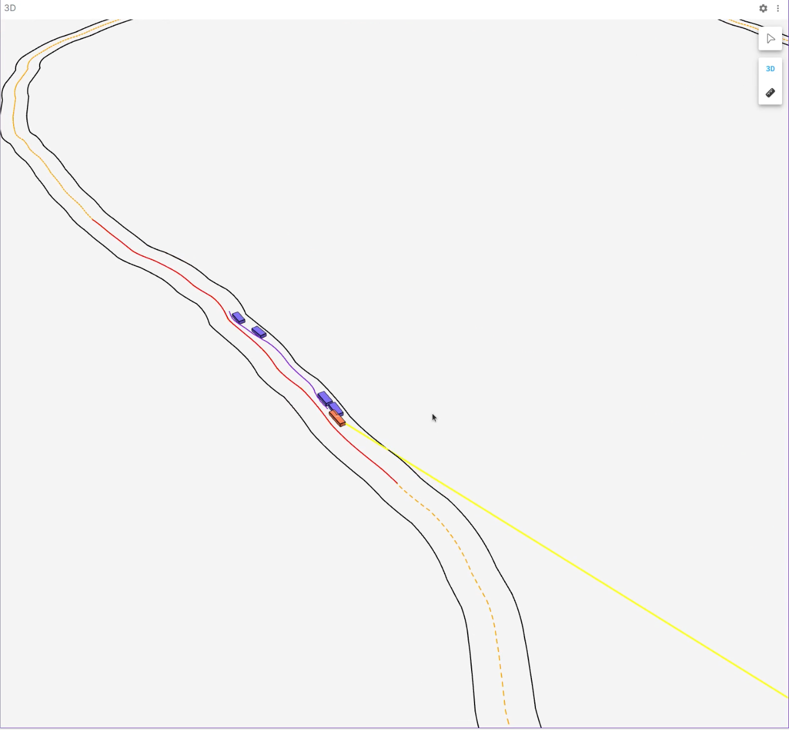
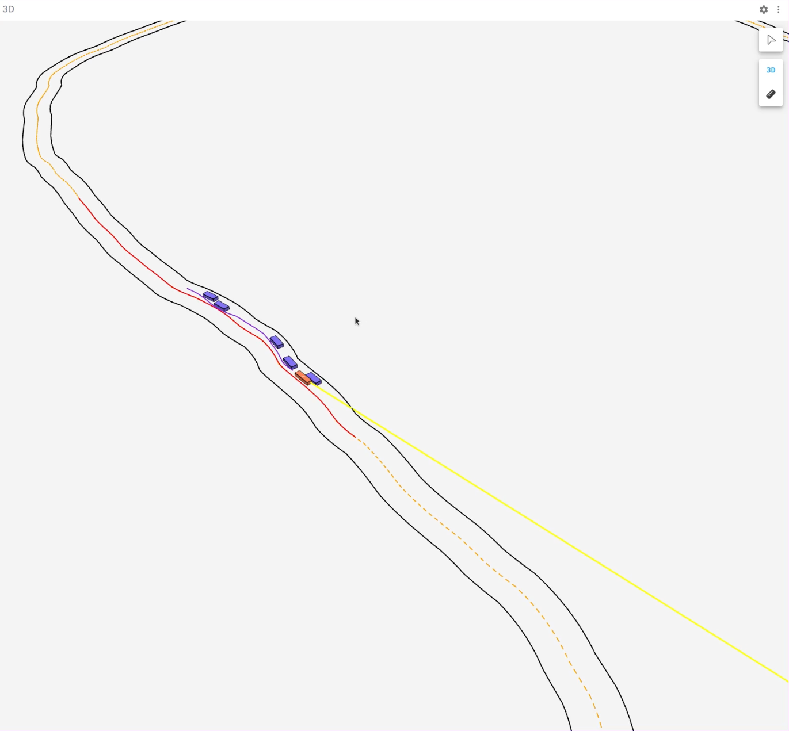
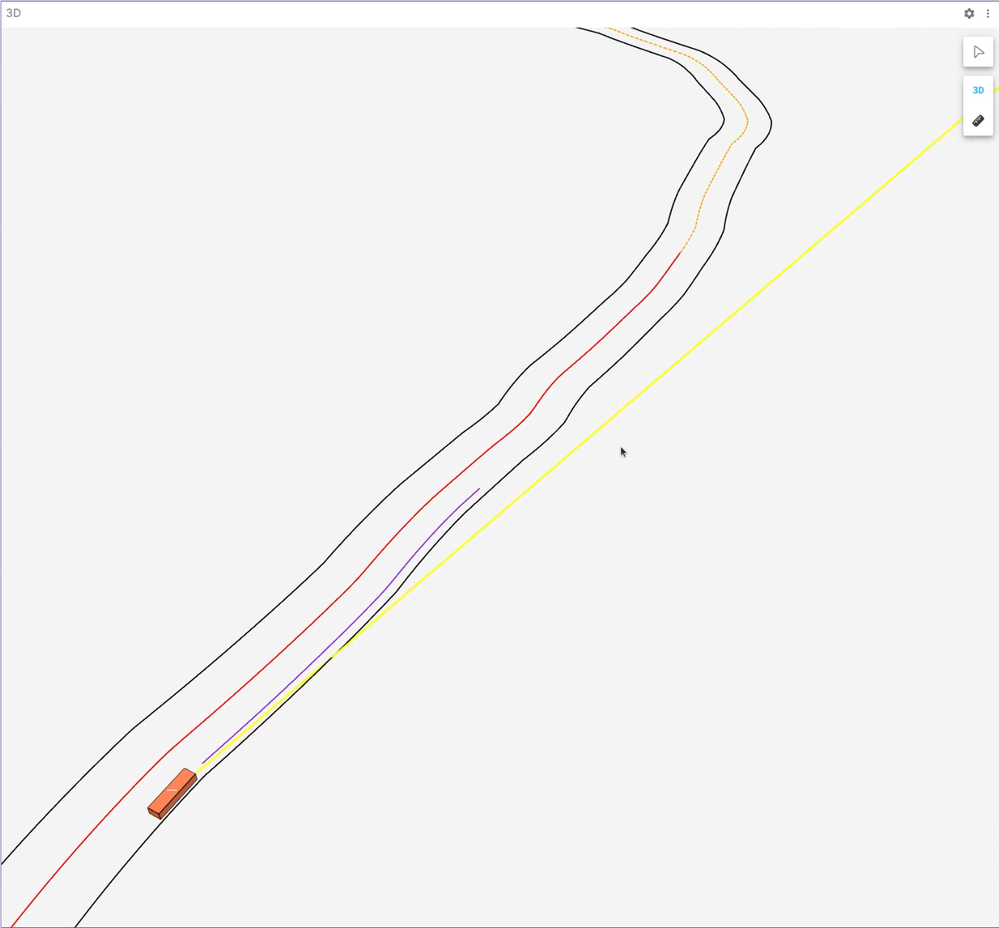
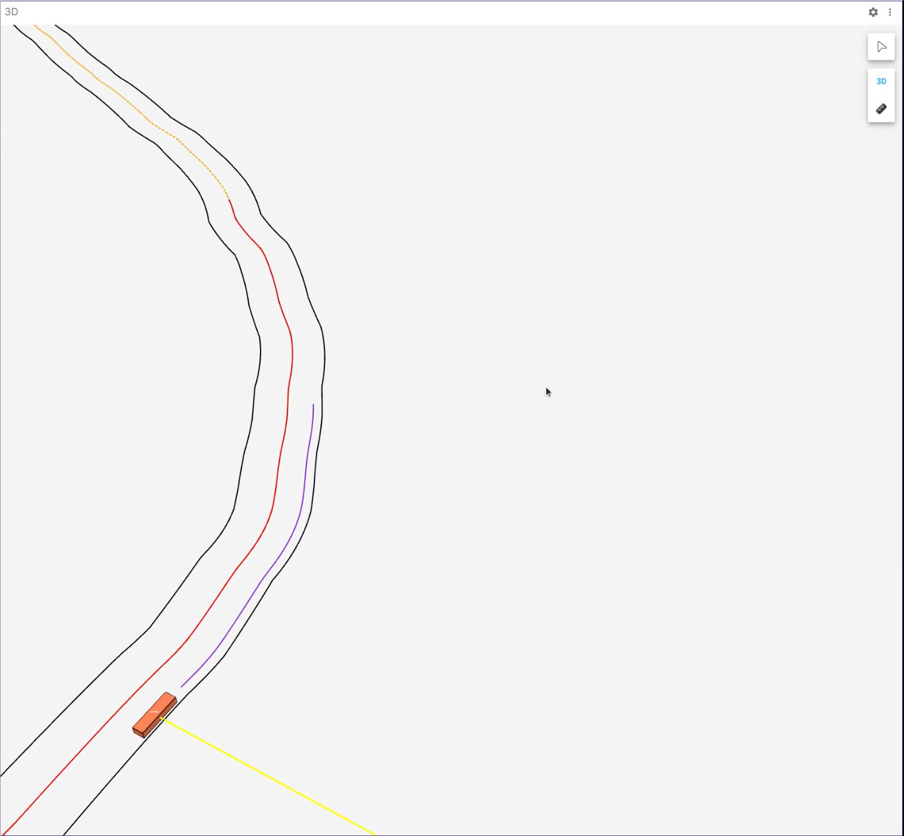

# EM Planner

This branch using foxglove-studio as visualization tool.

## 1. compile method

```shell
$ mkdir build
$ cd build
$ conan install .. --build=missing
# 上面这个命令会输出一些日志，其中就有介绍如何编译链接 conan 中库的方法，也就是下面这行命令
$ cmake .. -DCMAKE_TOOLCHAIN_FILE=/home/linkx/linkx_project/EMplanner/build/Debug/generators/conan_toolchain.cmake -DCMAKE_POLICY_DEFAULT_CMP0091=NEW -DCMAKE_BUILD_TYPE=Debug
$ make -j 4
$ ./main
```

## 2. Demo

<center class="half">
   
   
</center>

<center class="half">
   
   
</center>
